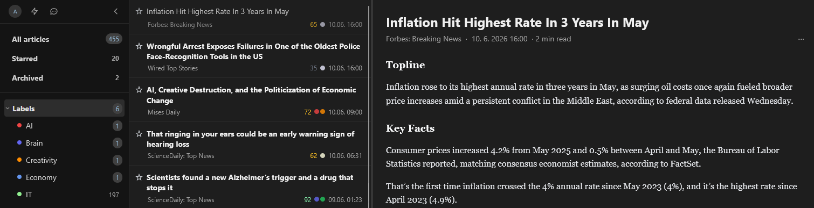
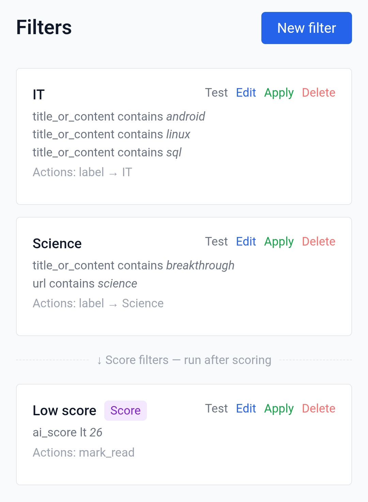

# Readfine

[](LICENSE)
[](https://github.com/jakublibik/readfine/releases)
[](https://readfine.app)


A self-hosted web RSS reader (inspired by Tiny Tiny RSS) with web scraping, filters,
readable extraction, and optional AI summaries, scoring, and briefings.

**Try the hosted instance:** [readfine.app](https://readfine.app), or self-host with the steps below.

> [!NOTE]
> **Built with AI.** Readfine is primarily AI-written (with Claude Code), with
> limited line-by-line human review. It's a real, working app that I use daily,
> but if you self-host it, treat it accordingly: review the code, and audit the
> security-sensitive parts (auth, key storage, SSRF protection) before trusting
> it with anything sensitive. No warranty; see [License](#license).



## Contents

- [Features](#features)
- [Quick demo (try locally)](#quick-demo-try-locally)
- [Requirements](#requirements)
- [Installation](#installation)
- [Client IP setting (login lockout)](#client-ip-setting-login-lockout)
- [If you open registration](#if-you-open-registration)
- [Updating](#updating)
- [Backups](#backups)
- [Useful commands](#useful-commands)
- [Development](#development)
- [Stack](#stack)
- [License](#license)

## Features

- **Feeds:** RSS/Atom plus **web-scraping feeds** (CSS selectors) for sites without a feed; folders and scheduled fetching
- **Reading:** readable extraction (trafilatura → readability-lxml fallback), article states, labels, dark mode (HTMX + Tailwind); YouTube and Vimeo videos play in the reader
- **Saved:** paste any link, from a feed or not, and keep it as a readable article that retention never removes (also via the API, so a share sheet or bookmarklet can do it)
- **Adaptive layout:** pick **2- or 3-panel** views per screen size with user-configurable breakpoints; a dedicated mobile layout (collapsible sidebar, inline or full-screen article view) that's more than mobile-friendly, not a squeezed-down desktop
- **Filters:** conditions → actions (label, mark read, star…), regex, AND/OR, feed/folder scoping, retroactive apply
- **AI (bring-your-own-key):** summaries, relevance scoring, chat over articles, and "Catch me up" digests & scheduled briefings (Anthropic / OpenAI / Gemini)
- **Accounts:** per-user settings, admin panel, SMTP, API tokens (JWT), tiered retention/purge
- **Import/export:** OPML (incl. Tiny Tiny RSS compatibility)

See [FEATURES.md](FEATURES.md) for the full list, grouped by area (also at `/features` in the app).

<p>
  
  
  
</p>

## Quick demo (try locally)

Just want to click around first? With Docker installed, from a clone of this repo:

```bash
docker compose -f docker-compose.demo.yml up
```

Then open **http://localhost:8000** and log in:

- **email:** `demo@example.com`
- **password:** `demodemo`

> [!WARNING]
> **Demo only, not for production.** This compose file runs plain HTTP with no
> reverse proxy, `DEBUG=true`, and **hard-coded throwaway secrets and admin
> credentials**. It exists purely to try the app in one command. For a real
> deployment use `setup.sh` below (unique secrets, TLS, your own admin account).
> Never expose the demo compose or reuse its keys.

Tear it down (and wipe the demo database) with:

```bash
docker compose -f docker-compose.demo.yml down -v
```

Prefer not to install anything? The hosted instance at
[readfine.app](https://readfine.app) has open registration.

## Requirements

- Docker + Docker Compose plugin
- A server with ports 80 and 443 open (or just 80 for IP-only installs)
- A Unix shell to run `setup.sh` (Linux or macOS)

> **On Windows?** The app itself is OS-agnostic (it runs in Docker), but `setup.sh` is a
> bash script. Run it inside **WSL2**, which Docker Desktop already uses on Windows anyway.
> Install [WSL2](https://learn.microsoft.com/windows/wsl/install) + Docker Desktop, then
> clone/unzip Readfine inside your WSL home and run `bash setup.sh` there. (`ssl.sh` for
> Let's Encrypt is Debian/Ubuntu-only; on other setups provide your own certificate.)

## Installation

### 1. Get the code

**Option A: download the latest release** (no git needed):
download the source `.zip` from the [latest release](https://github.com/jakublibik/readfine/releases/latest),
unzip it, and rename the folder to `readfine`. Using a **stable folder name** matters: Docker
Compose names your data volume after the folder, so keeping it consistent across updates is
what lets your database survive (otherwise an update looks like a fresh, empty install).

```bash
unzip readfine-*.zip
mv readfine-* readfine
cd readfine
```

**Option B: clone with git** (easier to update later):

```bash
git clone https://github.com/jakublibik/readfine.git
cd readfine
```

### 2. Prepare an SSL certificate (domain installs only)

You need a certificate before running setup. Two options:

**Option A: via your DNS/CDN provider** (e.g. Cloudflare Origin Certificate):
```bash
mkdir -p certs
nano certs/cert.pem   # paste the certificate
nano certs/cert.key   # paste the private key
```

**Option B: Let's Encrypt** (certbot must be able to bind port 80):
```bash
sudo bash ssl.sh your-domain.com admin@your-domain.com
mkdir -p certs
cp /etc/letsencrypt/live/your-domain.com/fullchain.pem certs/cert.pem
cp /etc/letsencrypt/live/your-domain.com/privkey.pem   certs/cert.key
```

> Skip this step entirely if you're installing on an IP address (HTTP only).

### 3. Run setup

```bash
bash setup.sh
```

The wizard will ask for:
- Database name, user, and password
- Admin email and password
- Domain or server IP

It will then generate the configuration, build and start all containers, and run database migrations automatically.

### 4. Log in

Open your browser at the URL shown at the end of setup and log in with the admin credentials you provided.

> **Registration is closed by default.** A fresh install starts with sign-ups disabled;
> only your admin account exists. To let other people register, enable it in the admin
> panel (configure SMTP first if you want email verification). Leaving it closed keeps the
> instance private / invite-only.

> **AI keys and SMTP are configured in the app, not in `.env`.** AI is bring-your-own-key
> and set per user under Settings → AI; SMTP (for verification/reset emails) is set by an
> admin in the admin panel. The only secrets in `.env` are the database, `SECRET_KEY`, and
> `ENCRYPTION_KEY`.

---

## Client IP setting (login lockout)

The login lockout keys on the visitor's IP. The bundled `docker-compose.yml` always runs
**nginx in front of the app**, so a Docker deployment always has at least one proxy. Tell
the app how many proxies sit in front so it can find the real visitor IP. Otherwise an
attacker could spoof headers and dodge the lockout.

**Pick one line and set it in `.env`:**

| How you run it | `.env` |
|---|---|
| Docker **+ Cloudflare** in front | `TRUST_CLOUDFLARE=true` |
| Docker, **no Cloudflare** | `TRUSTED_PROXY_COUNT=1` |
| App started manually without nginx (local dev) | leave default `TRUSTED_PROXY_COUNT=0` |

That's all most deployments need. The two settings are explained below.

### If you use Cloudflare: lock the origin down

`TRUST_CLOUDFLARE=true` trusts Cloudflare's `CF-Connecting-IP` header. That's only safe if
your server **cannot** be reached except through Cloudflare. Otherwise someone could hit
it directly with a forged header. Restrict inbound 80/443 to Cloudflare's IP ranges, e.g.
with UFW:

```bash
for cidr in $(curl -s https://www.cloudflare.com/ips-v4) $(curl -s https://www.cloudflare.com/ips-v6); do
  sudo ufw allow from "$cidr" to any port 80,443 proto tcp
done
sudo ufw deny 80/tcp
sudo ufw deny 443/tcp
```

### How `TRUSTED_PROXY_COUNT` works

`TRUSTED_PROXY_COUNT=N` reads the visitor IP from the `X-Forwarded-For` header counting `N`
entries from the **right**. Those are the hops your own proxies added. Anything further
left is supplied by the client and ignored, so it can't be spoofed. With the bundled nginx
that's `1`; add `1` more for each extra proxy you put in front.

> **Optional (nicer logs, not required):** to make the visitor IP correct in nginx's own
> access logs behind Cloudflare, add the real_ip module to your nginx config (replace
> `<CF range>` with each range from https://www.cloudflare.com/ips/). The login lockout
> works without this.
>
> ```nginx
> set_real_ip_from <CF range>;   # repeat for every Cloudflare range
> real_ip_header CF-Connecting-IP;
> ```

---

## If you open registration

Registration is off by default. If you turn it on in the admin panel, your instance will
send a verification email to whatever address a visitor types in. Bots look for exactly
that: they post scraped addresses through open signup forms to flood someone else's inbox,
and your domain is the one that ends up sending the spam.

Readfine ships with two traps on the registration form, both on by default with nothing to
configure: a hidden honeypot field, and a signed timestamp that rejects a form submitted
faster than a person could fill it. Together they stop the usual bulk form-stuffing.

For a public instance, add a second layer in front of the app. Rate-limit or challenge
`/register` at your reverse proxy or CDN. On Cloudflare, a WAF custom rule matching
`http.request.uri.path eq "/register"` with the **Managed Challenge** action does the job
and stays invisible to real visitors.

If you don't need public signup, leave registration closed and add people with invitation
links from the admin panel. That removes the problem entirely.

---

## Updating

**If you cloned with git:**

```bash
git pull
docker compose up -d --build
```

**If you downloaded the release zip:** download the new release and unzip it. Copy your
existing `.env`, `certs/`, `nginx.conf`, and `docker-compose.override.yml` (if you have one)
into it, then rename it to the **same folder name
as before** (`readfine`), replacing the old folder. Keeping the folder name identical is what
makes Docker reuse the same data volume. From that folder:

```bash
docker compose up -d --build
```

> **Keep your changes out of `docker-compose.yml`.** If you need to change the published
> ports, add a network, or drop the bundled nginx because you already run a reverse proxy,
> put it in a `docker-compose.override.yml` next to it. Docker Compose merges that file
> automatically, and it is git-ignored, so `git pull` keeps working. Editing
> `docker-compose.yml` itself works right up until a release changes the same file, and then
> the update stops with `Your local changes to the following files would be overwritten by
> merge`. To move an existing edit: copy it into the override file, then `git checkout --
> docker-compose.yml`. Only the service and keys you name are overridden; everything else
> stays as shipped.

```yaml
# docker-compose.override.yml — serve on 8080 instead of 80
services:
  nginx:
    ports:
      - "8080:80"
```

Your data lives in a Docker volume, not in the project folder, so it survives updates **as
long as the project folder keeps the same name** (see above).
Migrations run automatically on startup. Updates never re-run `setup.sh`; the `ENCRYPTION_KEY`
in `.env` must stay stable for the life of the install. Changing it makes all stored API keys
and feed passwords permanently unreadable.

> **Run a single worker.** Rate limiting and the login brute-force lockout are
> kept in process memory, so they only work correctly with **one** Uvicorn worker
> (the shipped `docker-compose.yml` does this). Adding workers silently splits the
> counters per worker and weakens those protections. Horizontal scaling would need
> a shared (DB/Redis) backend for the lockout, not yet implemented.

## Backups

Your data lives in the `postgres_data` Docker volume. Back it up somewhere **off
the server** so you can recover from disk loss, a bad migration, or accidental
`docker compose down -v`.

The repo ships `backup.sh`: it runs `pg_dump` inside the database container and
stores the dump in a [restic](https://restic.net) repository (encrypted,
deduplicated, with retention). The example config targets Cloudflare R2
(S3-compatible, generous free tier, no egress fees), but any restic backend works
(Backblaze B2, S3, an SFTP/storage box, etc.).

**Setup**

```bash
# 1. Install restic on the host (Debian/Ubuntu)
sudo apt-get install -y restic

# 2. Create an off-site bucket + API token (e.g. a Cloudflare R2 bucket and an
#    R2 API token with Object Read & Write), then configure the backup:
cp backup.env.example backup.env
chmod 600 backup.env
$EDITOR backup.env          # fill in repo URL, restic password, and S3 keys

# 3. Run it once to initialize the repo and take the first backup
./backup.sh

# 4. Schedule it nightly via cron (logs to a file you can inspect)
crontab -e
# 0 3 * * *  cd /opt/readfine && ./backup.sh >> /var/log/readfine-backup.log 2>&1
```

> **Store the secrets safely.** Keep the `RESTIC_PASSWORD` somewhere separate from
> the backups (a password manager). Without it the backups cannot be restored.
> Also back up your `.env` `ENCRYPTION_KEY` and `SECRET_KEY`: a restored database
> is useless without the original `ENCRYPTION_KEY` (stored API keys and feed
> passwords become permanently unreadable).

**Restore**

```bash
# Load the repo location and credentials into your shell first (any manual
# restic command needs them; backup.sh sources this file itself). Don't use
# sudo. It drops the environment.
set -a; . backup.env; set +a

restic snapshots                                   # list available backups
restic dump latest /readfine.sql > restore.sql     # extract the newest dump
docker compose exec -T db psql -U readfine -d readfine < restore.sql
```

Test a restore into a throwaway database at least once. An untested backup is not
a backup.

## Useful commands

```bash
# View logs
docker compose logs -f

# Restart the app
docker compose restart app

# Stop everything
docker compose down

# Stop and delete all data (irreversible)
docker compose down -v
```

**How much gets logged** is set by `LOG_LEVEL` in `.env` (`DEBUG`, `INFO`, `WARNING`,
`ERROR`). The default `WARNING` keeps the log to things that need attention; `INFO` adds
the running commentary from the scheduler and fetcher.

When a site starts answering `403` or `429`, `LOG_OUTBOUND_REQUESTS=true` writes one line
per outbound request (feed fetches, scraping, readable extraction) with the host, status,
HTTP version, elapsed time and any rate-limit headers, so you can read the real request
rate per host. It ignores `LOG_LEVEL`, so switching it on is enough. Restart the app after
changing either, and turn the outbound log back off when you're done. It is verbose.

```bash
# every outbound request to one host, with timestamps
docker compose logs --since 24h --no-log-prefix -t app | grep 'outbound host=www.example.com'
```

**When two instances share one host**, `FETCH_SCHEDULE_OFFSET_MIN` (0–14 minutes,
default `0`) shifts the 15-minute feed fetch off the usual :00/:15/:30/:45, so a staging
instance next to production doesn't hit the same sites at the same moment. A single
instance can leave it at `0`. Restart the app after changing it.

## Development

### Requirements

- Node.js 18+ (for building Tailwind CSS)
- Python 3.12 + uv

### Setup

```bash
npm install
```

### CSS build

Tailwind CSS is compiled from templates into a static file, `backend/app/static/css/tailwind.css`. This file is committed to the repository.

**Rebuild after changing Tailwind classes in any template:**

```bash
npm run build
```

**Watch mode (auto-rebuild on every template save):**

```bash
npm run dev
```

Run this in a second terminal alongside `uvicorn` during development.

### Hybrid development (Postgres in Docker, app run locally)

The recommended dev setup: run only PostgreSQL in Docker and run FastAPI locally
via uv, so the app reloads instantly on code changes.

```bash
# 1. Create your local env file (DATABASE_URL already points at localhost:5432)
cp .env.example .env

# 2. Start only the database
docker compose up -d db

# 3. Install backend deps (includes the dev group) and apply migrations
cd backend
uv sync
uv run alembic upgrade head

# 4. Run the app with auto-reload
uv run uvicorn app.main:app --reload
```

The app is then at http://localhost:8000. Build the CSS once (`npm run build`) or
run `npm run dev` in watch mode alongside.

### Running tests

```bash
cd backend
uv run pytest
```

Most tests use mocks and need no database. The integration tests (retention,
catch-up) require the `db` container to be running; start it with
`docker compose up -d db` first. Without a reachable database they are skipped
locally (and fail in CI, where Postgres is always provisioned).

### Running the app in Docker

`docker-compose.yml` is a production setup: the `app` container runs from the
code baked into the image at build time, so updates require a rebuild
(`docker compose up -d --build`). There is intentionally no source bind mount.

If you prefer to develop with the app inside Docker and live-reload edits
without rebuilding, add a `docker-compose.override.yml` (gitignored, auto-loaded
locally) with a bind mount. Do **not** commit it, so production keeps building
immutable images:

```yaml
services:
  app:
    volumes:
      - ./backend:/app
```

### Updating HTMX

HTMX is self-hosted at `backend/app/static/js/htmx.min.js` (currently v2.0.4). To upgrade:

```bash
curl -o backend/app/static/js/htmx.min.js https://unpkg.com/htmx.org@<version>/dist/htmx.min.js
```

### Git hook (optional but recommended)

Automatically rebuilds CSS before every commit:

```bash
cp hooks/pre-commit .git/hooks/pre-commit
chmod +x .git/hooks/pre-commit
```

---

## Stack

- **Backend:** Python 3.12 + FastAPI
- **Database:** PostgreSQL 16
- **Frontend:** HTMX + Jinja2 + Tailwind CSS
- **Task queue:** APScheduler
- **Proxy:** nginx

---

## License

Copyright © Jakub Libík. Licensed under the **GNU Affero General Public License v3.0 or
later** (AGPL-3.0-or-later). See [LICENSE](LICENSE).

The AGPL's network clause (§13) means that if you run a modified version of Readfine as a
network service, you must offer its users the corresponding source, for example by linking
back to your fork from within the running app.
